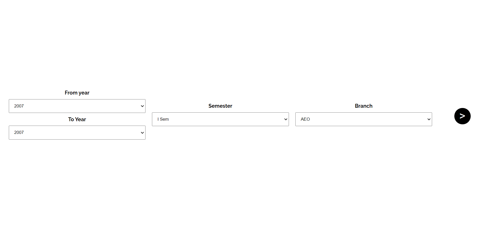

# MIT-LIBPORTAL PDF DOWNLOADER

Download all old question papers from Library Portal of MIT Manipal from the python file or from [here](https://library-dl.herokuapp.com/) !Remember to dowload or else the file will not be deleted from server!

If any issues please report

## How to use

1. Edit the values in the python file **libpy.py** according to sem and branch.
2. If any issues put up in the issue section.