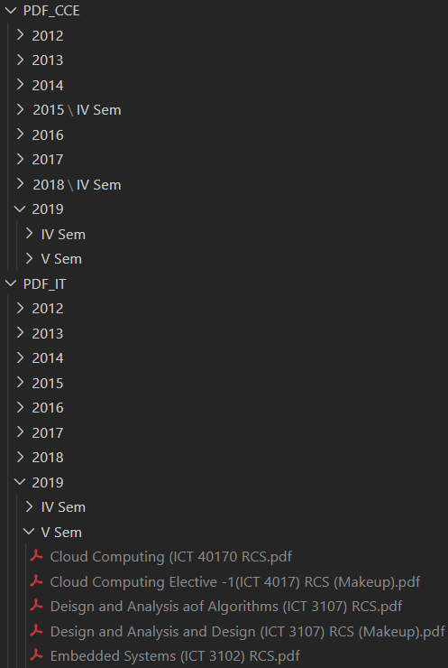
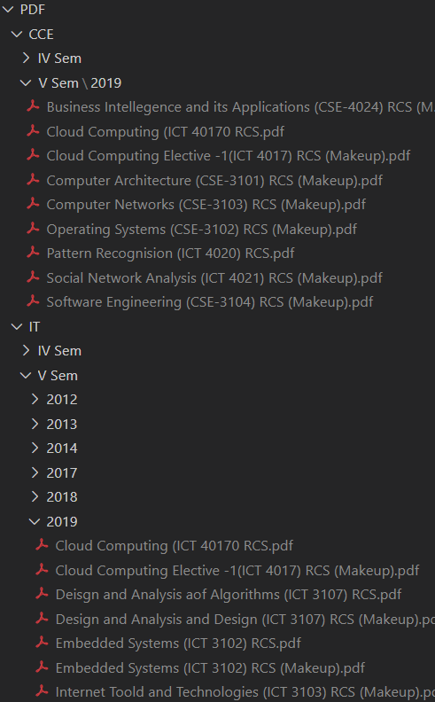

# LIBPORTAL PDF STEALER

Download all old question papers from Library Portal of MIT Manipal

If any issues please report

## How to use

:heavy_exclamation_mark: Both Libpy1 and Libpy2 give the same result, the difference is in segregation and creation of year folders :heavy_exclamation_mark:

1. Create a login.txt file containing "{username} {password}" for MITlibproxy as described in the respective py file.
2. Edit the values in the python file according to sem and branch.
3. If any issues put up in the issue section .

## Libpy1

Downloads and groups based on year > sem

## Libpy2

Downloads and group based on branch > sem > year

